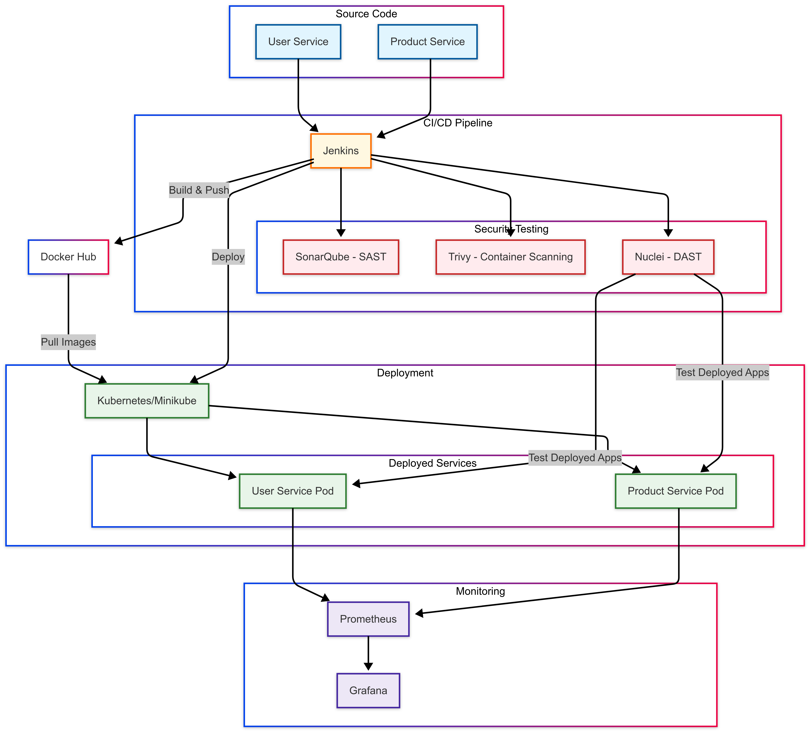

# DevSecOps Workshop Project

# DevSecOps Pipeline Workshop

This repository contains a simple DevSecOps pipeline demonstration project for educational purposes. The project showcases a complete CI/CD pipeline with security testing integration and monitoring capabilities, designed for a webinar/workshop setting.

## What is DevSecOps?

DevSecOps integrates security practices within the DevOps process. It involves introducing security earlier in the software development lifecycle through automation and collaboration between development, security, and operations teams.

## System Architecture

The project implements a complete DevSecOps pipeline with the following components:



> **Note**: The detailed architecture diagram source code is available in [architecture.md](docs/architecture.md).

### Key Components

1. **Source Code**
   - User Service (Python Flask)
   - Product Service (Python Flask)

2. **CI/CD Pipeline**
   - Jenkins for orchestration
   - Automated build, test, security scanning, and deployment

3. **Security Testing**
   - SonarQube for SAST (Static Application Security Testing)
   - Trivy for container vulnerability scanning
   - Nuclei for DAST (Dynamic Application Security Testing)

4. **Deployment**
   - Kubernetes (Minikube) for container orchestration
   - Automated deployment through Jenkins pipeline

5. **Monitoring**
   - Prometheus for metrics collection
   - Grafana for visualization and dashboards

## Project Components

### 1. Microservices
- **User Service**: Python Flask service for user management (port 5555)
  - Endpoints: `/health`, `/users`, `/users/<id>`
  - Simple CRUD operations for user data

- **Product Service**: Python Flask service for product management (port 5556)
  - Endpoints: `/health`, `/products`, `/products/<id>`, `/products/user/<id>`
  - Demonstrates service-to-service communication by calling User Service

### 2. CI/CD Pipeline
- **Jenkins**: Orchestrates the entire pipeline
  - Automated build, test, security scan, and deployment stages
  - Integration with security tools

### 3. Security Testing
- **SonarQube**: Static Application Security Testing (SAST)
  - Code quality and security analysis
  - Identifies code vulnerabilities, bugs, and code smells

- **Trivy**: Container vulnerability scanning
  - Scans container images for vulnerabilities
  - Identifies package vulnerabilities in dependencies

- **Nuclei**: Dynamic Application Security Testing (DAST)
  - Tests running applications for security issues
  - Uses templates to identify common vulnerabilities

### 4. Deployment
- **Kubernetes**: Container orchestration
  - Deployments, Services, and Ingress resources
  - Scalable and resilient application deployment

### 5. Monitoring
- **Prometheus**: Metrics collection
  - Scrapes metrics from all services
  - Provides time-series data for monitoring
  - Integrated with Pushgateway for Jenkins pipeline metrics

- **Grafana**: Visualization and dashboards
  - Pre-configured dashboards for service health
  - CPU, memory, and disk usage monitoring
  - Pipeline performance and success rate visualization

- **Pushgateway**: Metrics aggregation
  - Collects CI/CD pipeline metrics
  - Enables short-lived jobs to expose metrics

## Step-by-Step DevSecOps Pipeline Guide

This comprehensive guide will walk you through setting up and running a complete DevSecOps pipeline with Kubernetes integration.

### Prerequisites

Before starting, make sure you have the following installed:

- Docker and Docker Compose
- Git
- Minikube (for local Kubernetes cluster)
- kubectl (Kubernetes CLI)
- Docker Hub account (for pushing images)

### Step 1: Clone the Repository

```bash
git clone https://github.com/yourusername/seminaire-devsecops.git
cd seminaire-devsecops
```

### Step 2: Prepare the Environment

1. Make the setup script executable:
   ```bash
   chmod +x setup.sh
   ```

2. Run the setup script:
   ```bash
   ./setup.sh
   ```

3. When prompted, type `y` to reset your environment completely (recommended for a fresh start).

4. The setup script will:
   - Check for required tools (Docker, Docker Compose, Minikube, kubectl)
   - Stop and remove any existing containers and volumes
   - Delete and recreate your Minikube cluster if needed
   - Create necessary directories and set permissions
   - Start Minikube with required addons (ingress, metrics-server)
   - Start all services with Docker Compose
   - Install required Jenkins plugins

5. Wait for all services to start (this may take a few minutes).

### Step 3: Understanding the Jenkins Plugins Installation

The setup script automatically runs the Jenkins plugins installation script (`jenkins/install-plugins.sh`). This script:

1. Installs the following essential plugins for the DevSecOps pipeline:
   ```
   kubernetes
   workflow-aggregator
   git
   docker-workflow
   credentials-binding
   pipeline-utility-steps
   blueocean
   docker-plugin
   github
   github-branch-source
   pipeline-stage-view
   pipeline-graph-analysis
   dashboard-view
   sonar
   jacoco
   htmlpublisher
   ```

2. These plugins provide functionality for:
   - Kubernetes integration for deploying to Minikube
   - Pipeline visualization and analysis
   - Git and GitHub integration
   - Docker integration for building and pushing images
   - Credentials management for secure access to Docker Hub and Kubernetes
   - SonarQube integration for code quality and security scanning
   - HTML report publishing for test and security scan results

3. You can manually run the plugin installation script if needed:
   ```bash
   chmod +x jenkins/install-plugins.sh
   ./jenkins/install-plugins.sh
   ```

4. After plugin installation, Jenkins automatically restarts to apply the changes.

### Step 4: Verify Services are Running

1. Check that all Docker containers are running:
   ```bash
   docker compose ps
   ```

2. Verify Minikube is running:
   ```bash
   minikube status
   ```

3. Access the services in your browser:
   - Jenkins: http://localhost:8080 (admin/admin)
   - SonarQube: http://localhost:9000 (admin/admin)
   - Prometheus: http://localhost:9090
   - Grafana: http://localhost:3000 (admin/admin)
   - User Service: http://localhost:5555/health
   - Product Service: http://localhost:5556/health

### Step 5: Create Docker Hub Access Token

1. Log in to your Docker Hub account at https://hub.docker.com/
2. Go to Account Settings > Security
3. Click "New Access Token"
4. Enter a description (e.g., "Jenkins DevSecOps")
5. Select appropriate permissions (at least "Read & Write")
6. Click "Generate" and copy the token (you won't be able to see it again)

### Step 6: Configure Jenkins Credentials

1. Access Jenkins at http://localhost:8080
2. Log in with username `admin` and password `admin`
3. Go to Manage Jenkins > Manage Credentials
4. Click on "Jenkins" under Stores scoped to Jenkins
5. Click on "Global credentials (unrestricted)"
6. Click "Add Credentials" in the left sidebar

7. Add Docker Hub credentials:
   - Kind: Username with password
   - Scope: Global
   - Username: Your Docker Hub username
   - Password: Your Docker Hub access token (from Step 4)
   - ID: `docker-credentials` (must match exactly)
   - Description: Docker Hub Credentials
   - Click "OK"

8. Click "Add Credentials" again
9. Add Kubernetes configuration:
   - Kind: Kubernetes configuration (kubeconfig)
   - Scope: Global
   - ID: `kubernetes-config` (must match exactly)
   - Content: Enter directly
   - Kubeconfig: Paste output from this command:
     ```bash
     kubectl config view --minify --flatten
     ```
   - Description: Kubernetes Config for Minikube
   - Click "OK"

### Step 7: Create Jenkins Pipeline

1. From the Jenkins dashboard, click "New Item"
2. Enter name: `devsecops-pipeline`
3. Select: Pipeline
4. Click "OK"
5. In the configuration page:
   - Under "Pipeline" section, select "Pipeline script from SCM"
   - SCM: Git
   - Repository URL: Your local path (e.g., `/Users/walidazhari/Desktop/seminaire-devsecops`)
   - Branch Specifier: `*/main` (or your default branch)
   - Script Path: `jenkins/Jenkinsfile`
   - Click "Save"

### Step 8: Update Jenkinsfile (if needed)

The Jenkinsfile should already be configured with your Docker Hub username, but verify the environment variables in `jenkins/Jenkinsfile`:

```groovy
environment {
    DOCKER_REGISTRY = "docker.io/walidazhari" // Change to your Docker Hub username if different
    USER_SERVICE_IMAGE = "${DOCKER_REGISTRY}/user-service:${BUILD_NUMBER}"
    PRODUCT_SERVICE_IMAGE = "${DOCKER_REGISTRY}/product-service:${BUILD_NUMBER}"
}
```

### Step 9: Run the Pipeline

1. Go to your pipeline job (`devsecops-pipeline`)
2. Click "Build Now"
3. Monitor the build progress in the "Build History" section
4. Click on the build number and then "Console Output" to see detailed logs

### Step 10: Verify Kubernetes Deployment

After the pipeline completes successfully:

1. Check that the services are deployed to Kubernetes:
   ```bash
   kubectl get all -n devsecops
   ```

2. Verify the pods are running:
   ```bash
   kubectl get pods -n devsecops
   ```

3. Check the services:
   ```bash
   kubectl get svc -n devsecops
   ```

### Step 11: Access the Deployed Applications

1. Get the Minikube IP:
   ```bash
   minikube ip
   ```

2. Access the services using the NodePort or by setting up port forwarding:
   ```bash
   kubectl port-forward service/user-service 8000:5555 -n devsecops
   ```
   Then access at http://localhost:8000

### Step 12: Monitor the Application

1. Access Grafana at http://localhost:3000 (admin/admin)
2. Explore the pre-configured dashboards:
   - Service Health Dashboard
   - Node Metrics Dashboard
   - CI/CD Pipeline Metrics Dashboard

### Step 13: Review Security Scan Results

1. Check SonarQube results at http://localhost:9000
2. Review Trivy scan results in the Jenkins pipeline output
3. Check DAST scan results from Nuclei in the Jenkins pipeline output

### Troubleshooting

1. **Jenkins plugins not installed properly**:
   Run the plugin installation script manually:
   ```bash
   chmod +x jenkins/install-plugins.sh
   ./jenkins/install-plugins.sh
   ```

2. **Minikube not running**:
   Start Minikube manually:
   ```bash
   minikube start --driver=docker
   minikube addons enable ingress
   minikube addons enable metrics-server
   ```

3. **Docker Hub authentication issues**:
   Verify your Docker Hub credentials are correct in Jenkins and that you're using an access token, not your password.

4. **Kubernetes deployment fails**:
   Check the Kubernetes configuration credentials in Jenkins and ensure Minikube is running properly.

5. **Complete reset**:
   If you encounter persistent issues, run the setup script again with the reset option:
   ```bash
   ./setup.sh
   ```
   And select 'y' when prompted to reset everything.

### Monitoring Dashboard

1. Access Grafana at http://localhost:3000 with default credentials:
   - Username: `admin`
   - Password: `admin`

2. View the pre-configured dashboards:
   - Service Health Dashboard
   - Node Metrics Dashboard
   - CI/CD Pipeline Metrics Dashboard

3. Pipeline metrics are automatically sent to Prometheus via Pushgateway after each build

3. Access the services:
   - Jenkins: http://localhost:8080
   - SonarQube: http://localhost:9000
   - Prometheus: http://localhost:9090
   - Grafana: http://localhost:3000
   - User Service: http://localhost:5555
   - Product Service: http://localhost:5556

## Running the DevSecOps Pipeline

1. Access Jenkins at http://localhost:8080
2. Login with the credentials (admin/admin)
3. The pipeline job should be automatically configured
4. Run the pipeline by clicking "Build Now"

## Demonstrating Security Vulnerabilities

For demonstration purposes, you can introduce the following vulnerabilities:

### 1. SQL Injection (for SonarQube to detect)

In the user-service/app.py file, modify the get_user function:

```python
@app.route('/users/<id>', methods=['GET'])
def get_user(id):
    # Vulnerable code - SQL injection
    query = "SELECT * FROM users WHERE id = " + id
    # Execute query...
    return jsonify({"user": {"id": id, "name": "User " + id}})
```

### 2. Dependency Vulnerability (for Trivy to detect)

Add a vulnerable dependency in requirements.txt:

```
flask==0.12.2  # Known vulnerable version
requests==2.18.0  # Known vulnerable version
```

### 3. Insecure Endpoint (for Nuclei to detect)

Add an insecure endpoint in the product-service/app.py:

```python
@app.route('/debug', methods=['GET'])
def debug():
    # Insecure debug endpoint that exposes system information
    import os
    system_info = os.popen('uname -a').read()
    return jsonify({"system_info": system_info})
```

## Workshop Presentation Guide

### 1. Introduction to DevSecOps (10 minutes)
- Explain the concept of DevSecOps
- Discuss the importance of integrating security into the CI/CD pipeline
- Present the architecture diagram

### 2. Microservices Overview (10 minutes)
- Explain the User Service and Product Service
- Show the code structure and API endpoints
- Demonstrate the services running

### 3. CI/CD Pipeline with Jenkins (15 minutes)
- Walk through the Jenkinsfile stages
- Explain how Jenkins orchestrates the pipeline
- Show a pipeline execution

### 4. Security Testing (20 minutes)
- Introduce the security vulnerabilities
- Run the pipeline to detect them
- Show how each tool (SonarQube, Trivy, Nuclei) identifies different types of vulnerabilities

### 5. Kubernetes Deployment (10 minutes)
- Explain the Kubernetes manifests
- Show the deployed services

### 6. Monitoring with Prometheus and Grafana (10 minutes)
- Show the Grafana dashboards
- Explain the metrics being collected

### 7. Q&A and Discussion (15 minutes)
- **Prometheus**: Metrics collection and alerting
- **Grafana**: Visualization and dashboarding for monitoring data

## Project Structure
```
seminaire-devsecops/
├── services/
│   ├── user-service/       # Python-based user service
│   └── product-service/    # Python-based product service
├── jenkins/                # Jenkins configuration and pipeline definitions
├── kubernetes/             # Kubernetes manifests for deployment
├── security/
│   ├── sonarqube/          # SonarQube configuration for SAST
│   ├── trivy/              # Trivy configuration for SCA
│   └── nuclei/             # Nuclei configuration for DAST
└── monitoring/
    ├── prometheus/         # Prometheus configuration
    └── grafana/            # Grafana dashboards and configuration
```

## Workshop Steps

1. **Setup Development Environment**
   - Install Docker and Docker Compose
   - Clone the repository

2. **Build Microservices**
   - Develop User and Product services in Python
   - Create Dockerfiles for each service
   - Test services locally

3. **Setup CI/CD Pipeline**
   - Configure Jenkins with Docker
   - Create Jenkinsfile with pipeline stages
   - Setup webhook integration

4. **Implement Security Testing**
   - Configure SonarQube for SAST
   - Setup Trivy for container scanning
   - Configure Nuclei for DAST

5. **Setup Kubernetes Deployment**
   - Create Kubernetes manifests
   - Configure deployment, services, and ingress

6. **Implement Monitoring**
   - Setup Prometheus for metrics collection
   - Configure Grafana dashboards
   - Implement alerting

7. **Run Complete Pipeline**
   - Trigger Jenkins pipeline
   - Observe security testing results
   - Monitor deployment in Kubernetes
   - View metrics in Grafana

## Prerequisites
- Docker and Docker Compose
- kubectl (Kubernetes CLI)
- Git

## Getting Started
Detailed instructions for each step will be provided during the workshop.
