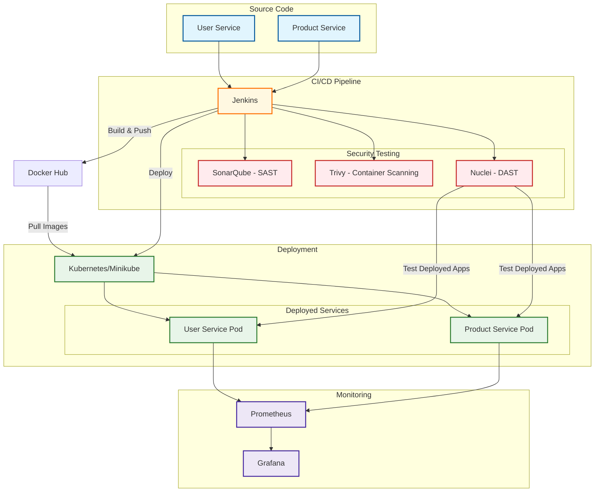

# DevSecOps Pipeline Architecture

## Components Description

### Source Code
- **User Service**: Python Flask microservice for user management
- **Product Service**: Python Flask microservice for product management that communicates with User Service

### CI/CD Pipeline
- **Jenkins**: Orchestrates the entire pipeline with stages for build, test, security scanning, and deployment
  
### Security Testing
- **SonarQube**: Static Application Security Testing (SAST) to detect code vulnerabilities
- **Trivy**: Container vulnerability scanner to detect issues in Docker images
- **Nuclei**: Dynamic Application Security Testing (DAST) to test running applications

### Deployment
- **Kubernetes/Minikube**: Local Kubernetes cluster for container orchestration
- **Deployed Services**: Containerized microservices running in Kubernetes pods

### Monitoring
- **Prometheus**: Metrics collection and monitoring
- **Grafana**: Visualization dashboards for metrics and performance monitoring

## Data Flow

1. Developers push code to the repository
2. Jenkins pipeline is triggered
3. Code is built and tested
4. Security scans are performed (SAST with SonarQube)
5. Docker images are built and scanned (with Trivy)
6. Images are pushed to Docker Hub
7. Kubernetes manifests are updated with new image tags
8. Applications are deployed to Kubernetes/Minikube
9. DAST scans are performed on the running applications (with Nuclei)
10. Metrics are collected by Prometheus and visualized in Grafana
